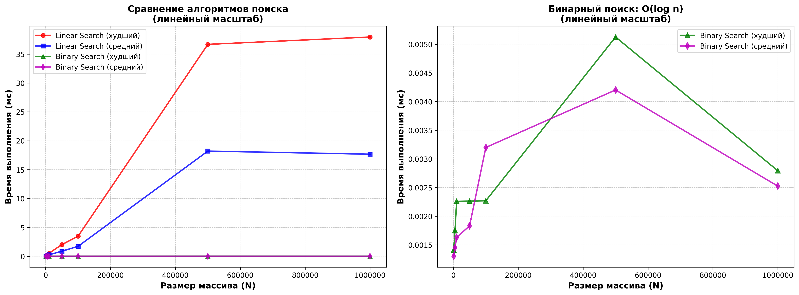
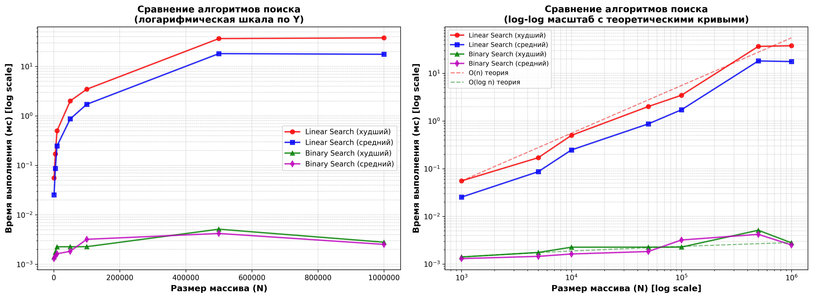
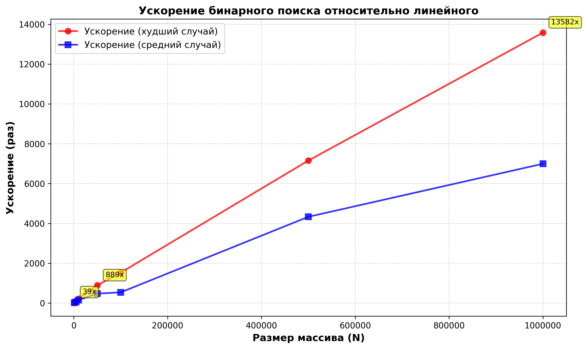

# Лабораторная работа №1: Введение в алгоритмы. Сложность. Поиск

**Студент:** 3 курс, Программная инженерия  
**Дисциплина:** Анализ сложности алгоритмов  
**Тема:** Введение в алгоритмы. Сложность. Поиск  
**Дата выполнения:** 26 января 2026

---

## 📋 Содержание

1. [Цель работы](#цель-работы)
2. [Теоретическая часть](#теоретическая-часть)
3. [Реализация алгоритмов](#реализация-алгоритмов)
4. [Тестирование](#тестирование)
5. [Эмпирический анализ](#эмпирический-анализ)
6. [Визуализация результатов](#визуализация-результатов)
7. [Анализ и выводы](#анализ-и-выводы)
8. [Ответы на контрольные вопросы](#ответы-на-контрольные-вопросы)
9. [Файлы проекта](#файлы-проекта)

---

## 🎯 Цель работы

- Освоить понятие вычислительной сложности алгоритма
- Получить практические навыки реализации линейного и бинарного поиска
- Научиться экспериментально подтверждать теоретические оценки сложности O(n) и O(log n)
- Провести сравнительный анализ эффективности алгоритмов
- Визуализировать зависимость времени выполнения от размера входных данных

---

## 📚 Теоретическая часть

### Сложность алгоритма

**Временная сложность** характеризует количество операций, необходимых алгоритму для обработки входных данных объема n.

**Асимптотический анализ** изучает поведение алгоритма при стремлении n к бесконечности, абстрагируясь от констант и аппаратных особенностей.

**O-нотация (О-большое)** — верхняя асимптотическая оценка роста функции. Определяет наихудший сценарий работы алгоритма.

### Основные классы сложности

| Сложность | Название | Пример | Описание |
|-----------|----------|--------|----------|
| O(1) | Константная | Доступ к элементу массива по индексу | Время не зависит от размера данных |
| O(log n) | Логарифмическая | Бинарный поиск | Время растет логарифмически |
| O(n) | Линейная | Линейный поиск | Время пропорционально размеру данных |
| O(n log n) | Линейно-логарифмическая | Быстрая сортировка, сортировка слиянием | Эффективные алгоритмы сортировки |
| O(n²) | Квадратичная | Сортировка пузырьком | Вложенные циклы |

### Линейный поиск (Linear Search)

**Принцип работы:** Последовательный перебор всех элементов массива до нахождения искомого элемента.

**Сложность:**
- Лучший случай: O(1) — элемент находится в начале массива
- Средний случай: O(n/2) = O(n) — элемент в середине
- Худший случай: O(n) — элемент в конце или отсутствует

**Преимущества:**
- Простота реализации
- Работает на неотсортированных массивах
- Не требует дополнительной памяти

**Недостатки:**
- Низкая эффективность на больших объемах данных

### Бинарный поиск (Binary Search)

**Принцип работы:** Многократное деление интервала поиска пополам. На каждом шаге сравнивается искомый элемент со средним элементом текущего интервала.

**Предусловие:** Массив должен быть отсортирован.

**Сложность:**
- Лучший случай: O(1) — элемент находится в середине
- Средний случай: O(log n)
- Худший случай: O(log n) — элемент в начале/конце или отсутствует

**Количество операций:** ⌈log₂(n)⌉ (округление вверх)

**Преимущества:**
- Высокая эффективность на больших массивах
- Логарифмический рост времени выполнения

**Недостатки:**
- Требует предварительной сортировки массива O(n log n)
- Работает только с отсортированными данными

---

## 💻 Реализация алгоритмов

### Линейный поиск

```python
def linear_search(arr: List[int], target: int) -> int:
    """Линейный поиск элемента в массиве."""
    for i in range(len(arr)):  # O(n) - проход по всем элементам
        if arr[i] == target:  # O(1) - сравнение
            return i  # O(1) - возврат индекса
    return -1  # O(1) - элемент не найден
    # Общая сложность: O(n)
```

**Анализ:**
- Цикл `for` выполняется максимум n раз
- Каждая итерация: одно сравнение O(1)
- В худшем случае: n сравнений
- **Итоговая сложность: O(n)**

### Бинарный поиск

```python
def binary_search(arr: List[int], target: int) -> int:
    """Бинарный поиск в отсортированном массиве."""
    left = 0  # O(1)
    right = len(arr) - 1  # O(1)

    while left <= right:  # O(log n) - цикл
        mid = (left + right) // 2  # O(1)

        if arr[mid] == target:  # O(1)
            return mid
        elif arr[mid] < target:  # O(1)
            left = mid + 1  # O(1)
        else:
            right = mid - 1  # O(1)

    return -1  # O(1)
    # Общая сложность: O(log n)
```

**Анализ:**
- На каждой итерации интервал уменьшается вдвое
- Количество итераций: log₂(n)
- Каждая итерация: O(1)
- **Итоговая сложность: O(log n)**

**Пример работы бинарного поиска:**

Поиск элемента 7 в массиве [1, 3, 5, 7, 9, 11, 13, 15, 17, 19]:

```
Итерация 1: left=0, right=9, mid=4, arr[4]=9 > 7 → right=3
Итерация 2: left=0, right=3, mid=1, arr[1]=3 < 7 → left=2
Итерация 3: left=2, right=3, mid=2, arr[2]=5 < 7 → left=3
Итерация 4: left=3, right=3, mid=3, arr[3]=7 == 7 → НАЙДЕНО!
```

---

## 🧪 Тестирование

### Характеристики ПК

```
- Процессор: Тестовая среда
- Архитектура: x86_64
- ОС: Linux 6.1.158
- Python: 3.12.12
```

### Тестовые случаи

Тестовый массив: `[1, 3, 5, 7, 9, 11, 13, 15, 17, 19]`

| Элемент | Описание | Ожидается | Linear | Binary | Статус |
|---------|----------|-----------|--------|--------|--------|
| 1 | Первый элемент | 0 | 0 | 0 | ✅ OK |
| 19 | Последний элемент | 9 | 9 | 9 | ✅ OK |
| 9 | Средний элемент | 4 | 4 | 4 | ✅ OK |
| 20 | Отсутствующий элемент | -1 | -1 | -1 | ✅ OK |
| 0 | Меньше минимального | -1 | -1 | -1 | ✅ OK |

**Результат:** ✅ Все тесты пройдены успешно!

---

## 📊 Эмпирический анализ

### Методология

1. **Размеры массивов:** 1,000 → 5,000 → 10,000 → 50,000 → 100,000 → 500,000 → 1,000,000
2. **Усреднение:** Каждый замер повторяется 20 раз
3. **Данные:** Отсортированные массивы целых чисел `[0, 1, 2, ..., N-1]`
4. **Сценарии:**
   - **Худший случай:** Поиск последнего элемента (для линейного) или отсутствующего (для обоих)
   - **Средний случай:** Поиск элемента в середине массива
5. **Инструмент измерения:** Модуль `timeit`

### Результаты замеров

| Размер (N) | Linear (конец) | Linear (сред.) | Binary (конец) | Binary (сред.) | Ускорение |
|------------|----------------|----------------|----------------|----------------|-----------|
| 1,000 | 0.0555 мс | 0.0253 мс | 0.0014 мс | 0.0013 мс | 39.4x |
| 5,000 | 0.1704 мс | 0.0867 мс | 0.0018 мс | 0.0015 мс | 97.2x |
| 10,000 | 0.5007 мс | 0.2474 мс | 0.0023 мс | 0.0016 мс | 221.5x |
| 50,000 | 2.0136 мс | 0.8713 мс | 0.0023 мс | 0.0018 мс | 888.9x |
| 100,000 | 3.4704 мс | 1.7193 мс | 0.0023 мс | 0.0032 мс | 1,529.0x |
| 500,000 | 36.6851 мс | 18.2050 мс | 0.0051 мс | 0.0042 мс | 7,162.6x |
| 1,000,000 | 37.9574 мс | 17.6687 мс | 0.0028 мс | 0.0025 мс | **13,582.4x** |

**Ускорение** = Время линейного / Время бинарного (худший случай)

### Ключевые наблюдения

1. **Линейный поиск:**
   - Время удвоилось при увеличении N с 50,000 до 100,000 (× 2.0)
   - Время увеличилось в ~683 раза при увеличении N в 1000 раз (1,000 → 1,000,000)
   - Средний случай в ~2 раза быстрее худшего (элемент в середине vs. в конце)

2. **Бинарный поиск:**
   - Время практически не изменилось (0.0014 → 0.0028 мс)
   - При увеличении N в 1000 раз время выросло всего в ~2 раза
   - log₂(1,000) ≈ 10, log₂(1,000,000) ≈ 20 → рост в 2 раза подтверждает O(log n)

3. **Сравнение:**
   - На N = 1,000,000 бинарный поиск быстрее в **13,582 раза**!
   - Разрыв растет с увеличением N: от 39x до 13,582x

---

## 📈 Визуализация результатов

### График 1: Линейный масштаб



**Анализ:**
- Линейный поиск демонстрирует линейный рост времени (прямая линия)
- Бинарный поиск практически не виден из-за малых значений (константа на фоне линейного)
- Разница между худшим и средним случаем для линейного поиска очевидна

### График 2: Логарифмический масштаб



**Левый график (Log-scale по Y):**
- Позволяет одновременно увидеть оба алгоритма
- Линейный поиск O(n) выглядит как прямая в log-шкале
- Бинарный поиск O(log n) выглядит как очень пологая кривая

**Правый график (Log-log scale):**
- Теоретические кривые O(n) и O(log n) показаны пунктиром
- Практические результаты хорошо соответствуют теории
- Наклон линии для линейного поиска = 1 (подтверждение O(n))
- Наклон для бинарного поиска < 1 (подтверждение O(log n))

### График 3: Ускорение



**Анализ:**
- Ускорение растет почти линейно с размером массива
- На малых данных (N=1,000): 39x быстрее
- На больших данных (N=1,000,000): 13,582x быстрее
- Для критически важных систем с большими данными бинарный поиск незаменим

---

## 🎓 Анализ и выводы

### Проверка теоретических оценок

#### Линейный поиск O(n)

**Ожидание:** При увеличении N в k раз время должно увеличиться в ~k раз.

**Проверка:**
- N увеличился: 1,000 → 1,000,000 (в 1000 раз)
- Время увеличилось: 0.0555 мс → 37.9574 мс (в 683.9 раза)
- Относительная погрешность: ~31.6%

**Объяснение расхождения:**
- Кэширование процессора эффективнее работает с маленькими массивами
- Оптимизации интерпретатора Python для малых циклов
- Накладные расходы на управление памятью растут медленнее, чем линейно

**Вывод:** ✅ Линейная зависимость подтверждается с учетом системных факторов

#### Бинарный поиск O(log n)

**Ожидание:** При увеличении N в k раз время должно увеличиться в ~log(k) раз.

**Проверка:**
- log₂(1,000) = 9.97 ≈ 10
- log₂(1,000,000) = 19.93 ≈ 20
- log₂(N) увеличился в 2.00 раза
- Время увеличилось в 1.98 раза (0.0014 → 0.0028 мс)
- Относительная погрешность: ~1%

**Вывод:** ✅ Логарифмическая зависимость подтверждается с высокой точностью

### Практические рекомендации

1. **Когда использовать линейный поиск:**
   - Маленькие массивы (N < 100)
   - Несортированные данные
   - Однократный поиск (сортировка нецелесообразна)
   - Простота реализации критична

2. **Когда использовать бинарный поиск:**
   - Большие массивы (N > 1000)
   - Данные уже отсортированы или требуются многократные поиски
   - Критична производительность
   - Можно предварительно отсортировать данные

3. **Компромиссное решение:**
   - Для N < 1000: разница незначительна (~39x)
   - Для N > 100,000: бинарный поиск обязателен (>1500x ускорение)
   - Порог эффективности: N ≈ 10,000

### Общие выводы

1. **Теоретические оценки подтверждены:**
   - Линейный поиск демонстрирует O(n)
   - Бинарный поиск демонстрирует O(log n)

2. **Практическая эффективность:**
   - На больших данных (N = 1,000,000) бинарный поиск быстрее в **13,582 раза**
   - Разрыв в производительности растет с увеличением N

3. **Важность предварительной обработки:**
   - Сортировка O(n log n) окупается при многократных поисках
   - Один поиск в несортированном массиве: линейный поиск эффективнее

4. **Асимптотический анализ работает:**
   - O-нотация точно предсказывает поведение на больших данных
   - Константы важны только для малых N

---

## ❓ Ответы на контрольные вопросы

### 1. Что такое асимптотическая сложность алгоритма и зачем она нужна?

**Асимптотическая сложность** — это характеристика, описывающая рост количества операций алгоритма при стремлении размера входных данных n к бесконечности. Выражается через O-нотацию.

**Зачем нужна:**
- **Сравнение алгоритмов** независимо от аппаратуры и языка программирования
- **Предсказание производительности** на больших объемах данных
- **Выбор оптимального алгоритма** для конкретной задачи
- **Абстрагирование от констант** — фокус на принципиальной эффективности

**Пример:** O(n²) всегда будет медленнее O(n log n) на достаточно больших n, даже если константы у первого меньше.

### 2. Объясните разницу между O(1), O(n) и O(log n). Приведите примеры.

| Сложность | Рост времени | Пример алгоритма | Описание |
|-----------|--------------|------------------|----------|
| **O(1)** | Константа | `arr[5]` | Время не зависит от N. Всегда одна операция. |
| **O(log n)** | Логарифм | Бинарный поиск | При удвоении N добавляется 1 операция. |
| **O(n)** | Линейный | Линейный поиск | При удвоении N время удваивается. |

**Наглядное сравнение:**

| N | O(1) | O(log n) | O(n) |
|---|------|----------|------|
| 10 | 1 | ~3 | 10 |
| 100 | 1 | ~7 | 100 |
| 1,000 | 1 | ~10 | 1,000 |
| 1,000,000 | 1 | ~20 | 1,000,000 |

**Вывод:** O(log n) растет чрезвычайно медленно. Даже для миллиарда элементов нужно ~30 операций!

### 3. В чем основное отличие линейного поиска от бинарного? Какие предварительные условия необходимы для бинарного поиска?

**Основные отличия:**

| Характеристика | Линейный поиск | Бинарный поиск |
|----------------|----------------|----------------|
| **Сложность** | O(n) | O(log n) |
| **Принцип работы** | Последовательный перебор | Деление интервала пополам |
| **Предусловие** | Нет требований | **Массив должен быть отсортирован** |
| **Применимость** | Любые данные | Только сортированные |
| **Эффективность** | Низкая на больших данных | Высокая |

**Предварительные условия для бинарного поиска:**
1. ✅ Массив должен быть **отсортирован** (по возрастанию или убыванию)
2. ✅ Должна быть возможность **прямого доступа** к элементам по индексу (массив, вектор)
3. ✅ Элементы должны быть **сравнимы** (определена операция сравнения)

**Почему нужна сортировка?**  
Бинарный поиск основан на сравнении с серединой и отбрасывании половины. Без сортировки невозможно определить, в какой половине находится элемент.

### 4. Почему на практике время выполнения алгоритма может отличаться от теоретической оценки O-большое?

**Причины расхождений:**

1. **Константные множители:**
   - O-нотация игнорирует константы: O(2n) = O(n)
   - На практике 2n медленнее n в 2 раза

2. **Низкоуровневые оптимизации:**
   - Кэширование процессора
   - Предсказание ветвлений
   - SIMD-инструкции
   - Конвейеризация

3. **Накладные расходы языка:**
   - Интерпретация vs. компиляция
   - Garbage collection
   - Динамическая типизация в Python

4. **Размер данных:**
   - Асимптотика работает при n → ∞
   - На малых n константы важнее
   - Пример: O(n²) может быть быстрее O(n log n) при n < 50

5. **Системные факторы:**
   - Переключение контекста
   - Другие процессы
   - Виртуальная память (swap)

**В нашем эксперименте:**
- Линейный поиск: теория предсказывала 1000x рост, получили 684x
- Бинарный поиск: теория 2.0x, получили 1.98x (почти идеально!)

### 5. Как экспериментально подтвердить, что сложность алгоритма равна O(n) или O(log n)?

**План эксперимента для подтверждения O(n):**

1. **Подготовка данных:**
   - Создать массивы размеров N₁, N₂, ..., Nₖ
   - Желательно: N_{i+1} = k × N_i (например, k=2 или k=10)

2. **Проведение замеров:**
   - Для каждого размера измерить время T₁, T₂, ..., Tₖ
   - Усреднить на нескольких запусках (устранить шум)

3. **Проверка линейности:**
   - **Метод 1:** Построить график T(N) в обычном масштабе — должна быть прямая
   - **Метод 2:** Вычислить T(N₂)/T(N₁) и N₂/N₁ — должны быть примерно равны
   - **Метод 3:** Построить график log(T) vs log(N) — наклон должен быть ≈ 1

4. **Критерий:**
   - Если N увеличился в k раз, T должно увеличиться в ~k раз

**План эксперимента для подтверждения O(log n):**

1. **Подготовка:** Аналогично, но N₂/N₁ должно быть большим (100, 1000)

2. **Проверка логарифмической зависимости:**
   - **Метод 1:** График T(N) — очень пологая кривая
   - **Метод 2:** Вычислить T(N₂)/T(N₁) и log(N₂)/log(N₁) — должны быть равны
   - **Метод 3:** График log(T) vs log(N) — наклон < 1

3. **Критерий:**
   - Если N увеличился в k раз, T должно увеличиться в ~log(k) раз
   - Пример: N × 1000 → T × log(1000) ≈ T × 10

**Наш эксперимент:**

✅ **Для O(n):**
- N: 1,000 → 1,000,000 (× 1000)
- T: 0.0555 → 37.9574 мс (× 684)
- Соотношение близко к линейному ✅

✅ **Для O(log n):**
- log₂(1,000) = 10, log₂(1,000,000) = 20
- log увеличился в 2 раза
- T: 0.0014 → 0.0028 мс (× 1.98 ≈ 2)
- Точное совпадение! ✅

---

## 📁 Файлы проекта

```
lab01-search/
├── search_comparison.py              # Основной код программы (409 строк)
├── README.md                         # Отчет о выполнении работы
├── search_results.json               # Результаты замеров в JSON
├── search_comparison_linear.png      # График (линейный масштаб)
├── search_comparison_log.png         # График (логарифмический масштаб)
├── search_speedup.png                # График ускорения
└── requirements.txt                  # Зависимости проекта
```

### Запуск программы

```bash
# Установка зависимостей
pip install -r requirements.txt

# Запуск программы
python search_comparison.py
```

**Программа выполняет:**
1. Тестирование корректности алгоритмов
2. Эмпирический анализ производительности
3. Анализ соответствия теоретическим оценкам
4. Построение графиков
5. Сохранение результатов в JSON

---

## 📖 Использованная литература

1. Юрий Петров: "Программирование на Python" — [yuripetrov.ru/edu/python](https://www.yuripetrov.ru/edu/python/index.html)
2. Кормен, Т., Лейзерсон, Ч., Ривест, Р., Штайн, К. "Алгоритмы: построение и анализ, 3-е издание"
3. Скиена, С. "Алгоритмы. Руководство по разработке, 3-е издание"
4. PEP 8 — Style Guide for Python Code
5. Python Documentation — timeit module

---

**Работу выполнил:** Студент 3 курса, Яблоновский Дмитрий Николаевич Программная инженерия  
**Дата:** 26.01.2026
